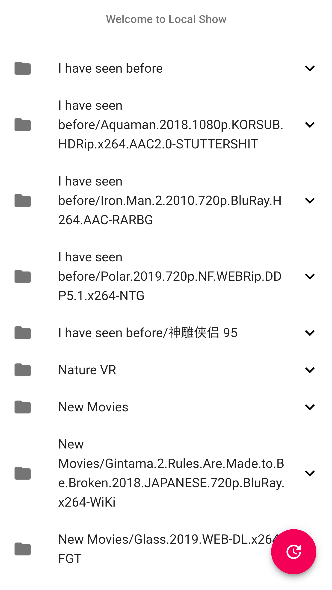

# Let you enjoy your PC media from webpage


> Aim to use reactjs to generate html files, then use golang to serve it.

___

#### How it looks like



___

#### Usage:
1. Download the binary file: https://github.com/yingshaoxo/Local_Show/releases/tag/0.6
2. Put it to the folder where your media exists
3. Run it!

> docker-compose: https://hub.docker.com/repository/docker/yingshaoxo/local_show

___

#### Complie:
Have `yarn` and `golang` installed first.

```
./Tools.sh build
```
___

#### Finished Feature list:

* Golang restful api for getting file_name and static url
* reactjs show files in a list (categorized by folder name)
* integrate with ReactPlayer
* could update file list and filter non-video files with one button
* could remember the last selection

___

#### Todo Feature list:

* supprt VR right in browser

___

#### Based on:

* https://github.com/gin-gonic/gin
* https://github.com/gin-contrib/cors
* https://github.com/gin-gonic/contrib/static
* https://github.com/mitchellh/gox

___

#### Thanks to:

* https://medium.com/@synapticsynergy/serving-a-react-app-with-golang-using-gin-c6402ee64a4b
* https://fabianlee.org/2018/05/10/docker-packaging-a-golang-version-of-hello-world-in-a-container/
